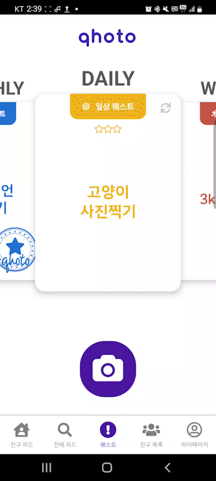
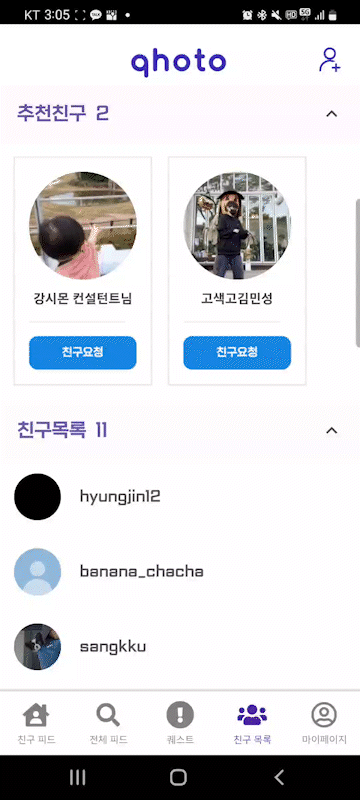
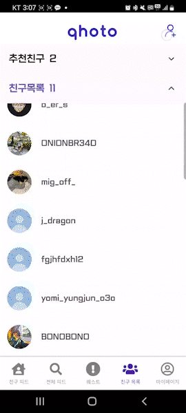
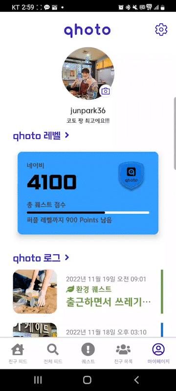

### 매일 똑같은 하루를 보내는 당신!

### 매일 다른 종류의 퀘스트로 본인의 일상을 공유하세요!

### 이제 똑같은 하루는 그만멈추고 재미와 함께 갓생을 살아보세요. 🤩

> **저희 앱 Qhoto에서는 매일, 매주, 매달**<br>**건강, 환경, 이색등 다양한 테마의 퀘스트를 제공하여 매일 똑같은 하루가 아닌 즐거운 추억을 제공해줍니다.**<br>**본인의 퀘스트 클리어 사진과 영상을 다른 사람과 공유해보세요!** <br>**서로 공유하다보면 당신의 인생은 ✨갓생✨ 이 되어있을겁니다.** > <br>

<br/>

## 🛠 기술 스택

#### Communication Tool

> 
> 
> 
> 

#### Development Tool

> 
> 
> 
> 
> 

#### FrontEnd

> 
> 
> 
> 
> 

#### BackEnd

> 
> 
> 
> 
> 

#### Server

> 
> 
> 
> 
> 
> 
> 

<br/>
<br/>

## 💡 기능 소개

</br>

### 1. 메인 페이지(퀘스트)

</br>


<br/>
<br/>

- 로그인 시 맨 처음 나타나는 화면
- Daily, Weekly, Monthly 퀘스트 정보 확인 가능
- 카드 우측 상단의 리롤버튼을 통해 퀘스트 선택 가능
  <br/>
  <br/>


<br/>
<br/>

- 메인페이지 하단의 카메라 버튼을 클릭해 카메라를 호출
- 퀘스트를 인증할 수 있는 사진, 동영상 촬영 후 제출
- photo editor 페이지에서 꾸미기 기능 제공
- 성공적으로 사진 제출 시 퀘스트 완료 도장 표시
  <br/>
  <br/>

### 2. 친구피드 페이지

<br/>

<br/>
<br/>

- Daily, Weekly, Monthly 퀘스트별로 나와 친구인 유저들의 퀘스트 인증 피드들을 모아놓은 페이지
- 좋아요, 댓글 작성 가능
- 우측 하단의 필터버튼을 클릭해 원하는 퀘스트 피드들 필터링 가능
  <br/>
  <br/>

### 3. 전체피드 페이지

<br/>


- 친구피드를 포함한 전체 유저들의 피드들을 확인할 수 있는 페이지
  <br/>
  <br/>

### 4. 친구목록 페이지

<br/>

<br/>
<br/>

- 친구 목록 리스트
- 로컬 기기의 연락처에 접근해 가입된 유저들 중 친구를 추천
  <br/>
  <br/>


<br/>
<br/>

- id 검색을 통해 친구 검색 및 친구 요청 보내기

<br/>

### 5. 마이페이지

<br/>

<br/>
<br/>

- 나의 레벨 정보, 퀘스트 성향 polygon chart, 타입별 완료한 퀘스트 막대 그래프
  <br/>
  <br/>


<br/>
<br/>

- 여태까지 완료했던 퀘스트 기록들
- 달력에서 해당 날짜에 완료한 퀘스트를 마커로 표시
  <br/>
  <br/>

## 📱 Wireframe

[Figma](https://www.figma.com/file/aFFFni2Q5Q9Myu0sxVAQme/qhoto?node-id=0%3A1&t=Am2MciN9gJYOk3wV-1)<br>


## 📏 ERD


## 💻 Software Architecture


## 📋 Convention

### JIRA

- STORY: 사용자 입장에서 작성하는 거

  - 사용자가 서비스 사용 흐름을 STORY로 적어 놓고 TASK를 이에 묶어놓기

- TASK

  - 기능

  - 앞에 태그 붙이기

    `[태그]<space>제목`

    - [TEAM] : 팀 회의
    - [BE] : 백엔드
    - [FE] : 프론트엔드
    - [DOCS]: 문서 작성
    - [STUDY]: 개인 학습

### GIT

- 태그 종류
  - `FEAT` : 새로운 기능 추가
  - `FIX` : 버그 수정
  - `DOCS` : 문서 수정
  - `STYLE` : 코드 포맷팅, 세미콜론 누락, 코드 변경이 없는 경우
  - `REFACTOR` : 코드 리펙토링
  - `TEST` : 테스트 코드, 리펙토링 테스트 코드 추가
  - `CHORE` : 빌드 업무 수정, 패키지 매니저 수정
- 형식

```java
[태그]<space>제목<space>(Jira Issue 링크)
ex) [FEAT] Add login (https://ssafy.atlassian.net/browse/S07P31A707-9)
```

- [template.md](http://template.md/) (MR 날릴때)

```java
## ⛅️ 내용

> 이 PR의 작업 요약 여기에 작성

## 🎸 특이사항

> 리뷰시 참고할만한 내용, 주의깊게 봐줬으면 하는 내용 여기에 작성

## 🎸 테스트

> 어떻게 테스트 할 수 있을까요? 여기에 작성
```

- Branch

```java
master
ㄴdevelop
		ㄴbackend_dev
			ㄴfeature/api/login
		ㄴfrontend_dev
			ㄴfeature/fe/register
```

- feature/api/login
- feature/fe/register

### **BE**

- 변수명 :

  camelCase

  - 카멜케이스

- 클래스명 :

  PascalCase

  - 카멜케이스 & 첫글자 대문자
  - DTO명
    - rest method 따라가기
    - 맨 마지막 url 따라가기
    - 겹치면 앞에 url까지 쓰기

### **FE**

- 파일명: 소문자

- CSS :

  kebab-case

  - 케밥케이스

### **DB**

- table: **snake_case**
- column
  - **snake_case:** 소문자&스네이크케이스
  - **primary key → id (Long, auto increment)**
  - full length → **column 명**

## 👪 팀원 소개

<table>
    <tr>
        <td height="140px" align="center"> <a href="https://github.com/PowerBBear">
             <br><br> 👑 박명규 <br>(Back-End) </a> <br></td>
        <td height="140px" align="center"> <a href="https://github.com/JunPark364">
             <br><br> 🙂 김상현 <br>(Back-End) </a> <br></td>
        <td height="140px" align="center"> <a href="https://github.com/pch8349">
             <br><br> 😆 김정아 <br>(Back-End) </a> <br></td>
        <td height="140px" align="center"> <a href="https://github.com/SilverLight96">
             <br><br> 😁 박영준 <br>(Front-End) </a> <br></td>
        <td height="140px" align="center"> <a href="https://github.com/heunhanireum">
             <br><br> 🙄 유경훈 <br>(Front-End) </a> <br></td>
        <td height="140px" align="center"> <a href="https://github.com/kkh9700">
             <br><br> 😶 정형진 <br>(Front-End) </a> <br></td>
    </tr>
    <tr>
        <td align="center">소셜 로그인<br/>서버 구축<br/>DB<br/></td>
        <td align="center">DB설계<br/>REST API<br/>
        <td align="center">DB설계<br/>REST API<br/>
        <td align="center">컴포넌트 구현<br/>발표</td>
        <td align="center">컴포넌트 구현<br/>소셜 로그인<br/></td>
        <td align="center">친구피드<br/>전체피드<br/></td>
    </tr>
</table>
